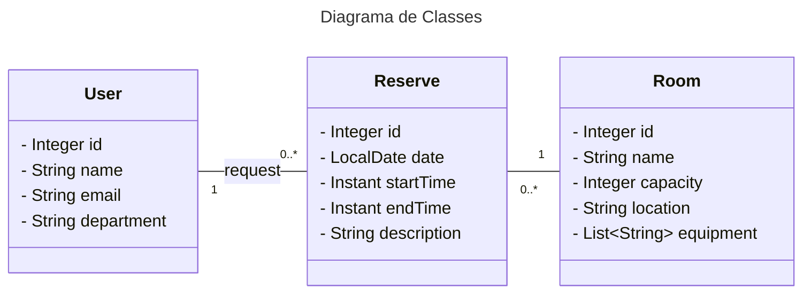

# DESAFIO: Publicando Sua API REST na Nuvem Usando Spring Boot 3.3.4, Java 23 e Railway

    Este projeto simula a API de uma reserva de salas de reunião.

    O Diagrama UML abaixo foi construido utilizando [Mermaid](https://mermaid.js.org/).

