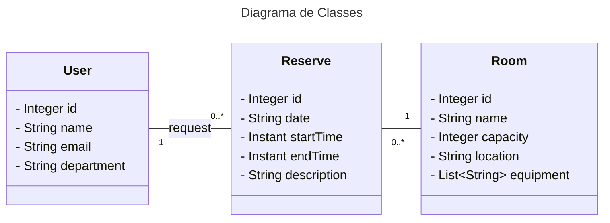

# DESAFIO: Publicando Sua API REST na Nuvem Usando Spring Boot 3.3.4, Java 23 e Railway

    Este projeto simula a API de uma reserva de salas de reunião.

    O Diagrama UML abaixo foi construido utilizando [Mermaid](https://mermaid.js.org/).

---
Devido incompatibilidade de versão do **Java 23** no Railway, a versão no modo produção foi ajustada para **Java 17**. Outra mudança no **Railway** foi a exclusão do projeto energetic-insight - web para criação de um novo projeto spirited-reprieve - Booker.
